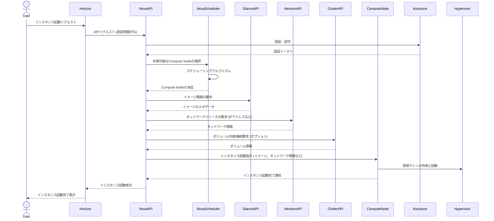
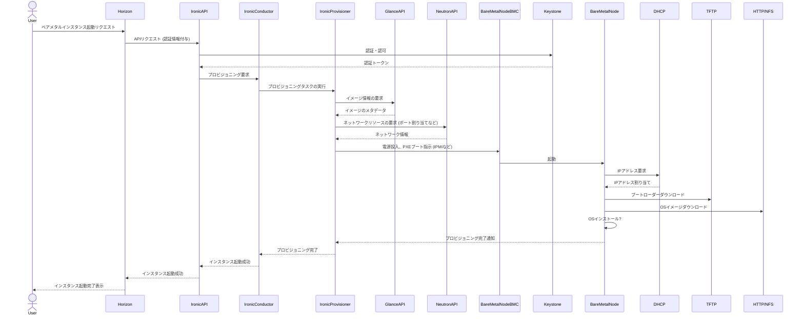

# OpenStack: VM（仮想マシン） vs PM（物理マシン、Bare Metal）

- [OpenStack: VM（仮想マシン） vs PM（物理マシン、Bare Metal）](#openstack-vm仮想マシン-vs-pm物理マシンbare-metal)
  - [1. VMインスタンス起動のシーケンスとコンポーネント](#1-vmインスタンス起動のシーケンスとコンポーネント)
    - [起動シーケンス:](#起動シーケンス)
  - [2. PMインスタンス起動のシーケンスとコンポーネント](#2-pmインスタンス起動のシーケンスとコンポーネント)
    - [起動シーケンス:](#起動シーケンス-1)
  - [3. アーキテクチャの違い](#3-アーキテクチャの違い)
  - [アーキテクチャの概念図 (簡略化):](#アーキテクチャの概念図-簡略化)
    - [VMインスタンス:](#vmインスタンス)
    - [PMインスタンス:](#pmインスタンス)

## 1. VMインスタンス起動のシーケンスとコンポーネント

VMインスタンスの起動は、主に以下のコンポーネントが連携して行われます。

1. Horizon (ダッシュボード): ユーザーがインスタンス起動などの操作を行うためのWebインターフェースです。
2. Nova (コンピュート): 仮想マシンのライフサイクルを管理するコアコンポーネントです。インスタンスの作成、起動、停止などを行います。
3. Keystone (アイデンティティ): ユーザー認証と認可を行うサービスです。
4. Glance (イメージ): 仮想マシンのディスクイメージを保管・管理するサービスです。
5. Neutron (ネットワーク): 仮想ネットワーク、サブネット、ルーター、セキュリティグループなどを提供するネットワークサービスです。
6. Cinder (ブロックストレージ): 仮想マシンに接続する永続的なブロックストレージを提供します（オプション）。
7. Compute Node: 実際に仮想マシンが動作する物理サーバーです。KVM、QEMUなどのハイパーバイザーが動作しています。

### 起動シーケンス:



## 2. PMインスタンス起動のシーケンスとコンポーネント

PMインスタンス（Bare Metal）の起動は、Ironicプロジェクトによって管理されます。仮想化レイヤーを介さずに、物理サーバーを直接プロビジョニングします。

1. Horizon (ダッシュボード): ユーザーがベアメタルインスタンス起動などの操作を行うためのWebインターフェースです。
2. Ironic (ベアメタル): 物理サーバーのプロビジョニングとライフサイクルを管理するサービスです。
3. Keystone (アイデンティティ): ユーザー認証と認可を行うサービスです。
4. Glance (イメージ): 物理サーバーにデプロイするOSイメージを保管・管理するサービスです。
5. Neutron (ネットワーク): 物理サーバーにネットワーク接続を提供します。
6. Conductor (Ironic): Ironic APIとIronic Provisionerワーカーの間を取り持つサービスです。
7. Ironic Provisioner: 実際のプロビジョニングタスクを実行するワーカーです。PXEブート、IPMI操作などを担当します。
8. Ironic Inspector (オプション): 物理サーバーのハードウェア情報を自動的に検出するサービスです。
9. Bare Metal Node: プロビジョニング対象の物理サーバーです。通常、BMC (Baseboard Management Controller) などの管理インターフェースを持ちます。

### 起動シーケンス:



## 3. アーキテクチャの違い

| 特徴 | VMインスタンス | PMインスタンス (Bare Metal) |
| ---- | ----------- | --------------- |
| 仮想化レイヤー | ハイパーバイザー (KVM, QEMUなど) を使用 | なし (物理ハードウェアを直接利用) |
| リソース管理 | ハイパーバイザーがCPU、メモリ、ストレージを抽象化 | 物理サーバーのリソースを直接管理 |
| プロビジョニング | Novaがハイパーバイザーを制御してVMを作成 | IronicがBMCなどを介して物理サーバーを直接プロビジョニング |
| ネットワーク | Neutronが仮想ネットワークを提供 | Neutronが物理ネットワークインターフェースを管理 |
| ストレージ | Cinderが仮想ボリュームを提供 (オプション) | 物理ディスクを直接利用、またはCinderボリュームを接続 |
| 起動時間 | 一般的に短い | 物理サーバーの起動とOSインストールが必要なため長い |
| パフォーマンス | 物理ハードウェアを共有するため、オーバーヘッドがある | 物理ハードウェアの性能を最大限に利用可能 |
| ユースケース | 柔軟性、高密度なワークロード、テスト環境など | 高いパフォーマンスが要求されるワークロード、HPCなど |

## アーキテクチャの概念図 (簡略化):

### VMインスタンス:

```markdown
+-------------+      +----------+      +-----------+      +----------+
| User/Horizon|----->| Nova API |----->| Nova      |----->| Compute  |
+-------------+      +----------+      | Scheduler |      | Node     |
                                       +-----------+      +----------+
                                                          | Hypervisor|
                                                          |   +----+   |
                                                          |   | VM |   |
                                                          |   +----+   |
```

### PMインスタンス:

```markdown
+-------------+      +-----------+      +-------------+      +---------------+      +---------------+
| User/Horizon|----->| Ironic API|----->| Ironic      |----->| Ironic        |----->| Bare Metal    |
+-------------+      +-----------+      | Conductor   |      | Provisioner   |      | Node (BMC)    |
                                       +-------------+      +---------------+      +---------------+
```
